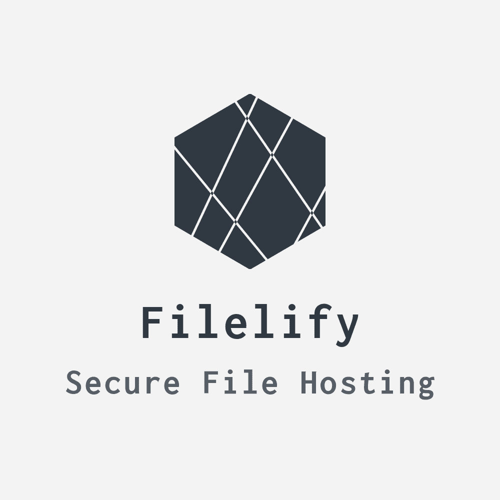

<p align="center">
  <a href="" rel="noopener">
 </a>
</p>

<h3 align="center">Filelify Backend</h3>

<div align="center">


<!--
[]()
[](https://github.com/kylelobo/The-Documentation-Compendium/issues)
[](https://github.com/kylelobo/The-Documentation-Compendium/pulls)
[](/LICENSE) -->

</div>

---

<p align="center"> <em>Well that sounds like google drive with extra steps.</em>
    <br> 
</p>

## 📝 Table of Contents

- [About](#about)
- [Getting Started](#getting_started)
- [Deployment](#deployment)
- [Usage](#usage)
- [Built Using](#built_using)
  <!-- - [TODO](../TODO.md) -->
  <!-- - [Contributing](../CONTRIBUTING.md) -->
- [Authors](#authors)
- [Acknowledgments](#acknowledgement)

## 🧐 About <a name = "about"></a>

This is a school project which I might refer to from a future portfolio website.

## 🏁 Getting Started <a name = "getting_started"></a>

### Prerequisites

- Node.js >= 13.2.0
- NPM >= 6.13.2

Install both from the [official website](https://nodejs.org/en/).

### Installing

1. Open a terminal window and switch into the desired installation folder.

2. Verify that node and npm are installed and are the right version.

```bash
node --version && npm -v
v13.2.0
6.13.1
```

3. Install dependencies.

```bash
npm install
```

4. Create a .env file and fil in the environment variables for prod and/or dev.

[Find out what environment variables you need.](#env)

5. Start the server:

`npm start` - Starts in development environment.

`npm run start:prod` - Starts in production environment.

`npm run watch` - Watches the files for changes with nodemon.

## 🔧 Running the tests <a name = "tests"></a>

### Unit tests

```bash
npm test
```

### Coding style tests

```
npm run lint
```

## 🎋 Environment Variables <a name="env"></a>

## 🎈 Usage <a name="usage"></a>

TODO

## 🚀 Deployment <a name = "deployment"></a>

TODO

## ⛏️ Built Using <a name = "built_using"></a>

- [Node.js](https://nodejs.org/en/) - Server Environment
- [PostgreSQL](https://www.postgresql.org/) - Database
- [Express](https://expressjs.com/) - Server Framework
- [lozio](https://logz.io/) - Logging

## ✍️ Authors <a name = "authors"></a>

- [@quest1onmark](https://github.com/quest1onmark) - Idea & Initial work

See also the list of [contributors](https://github.com/filelify/Backend/contributors) who participated in this project.

## 🎉 Acknowledgements <a name = "acknowledgement"></a>

- Hat tip to anyone whose code was used
- Inspiration
- References
